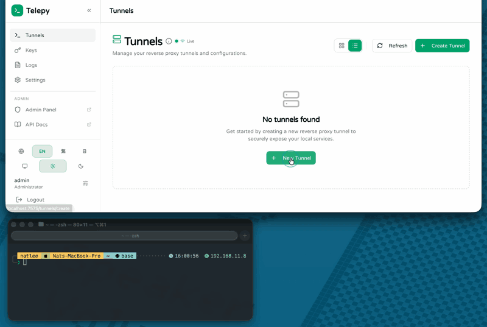
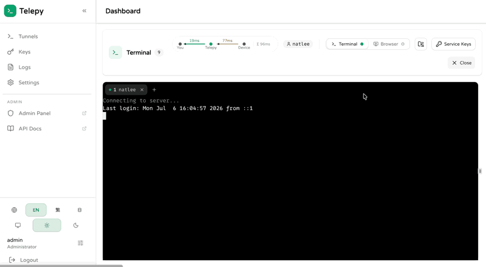
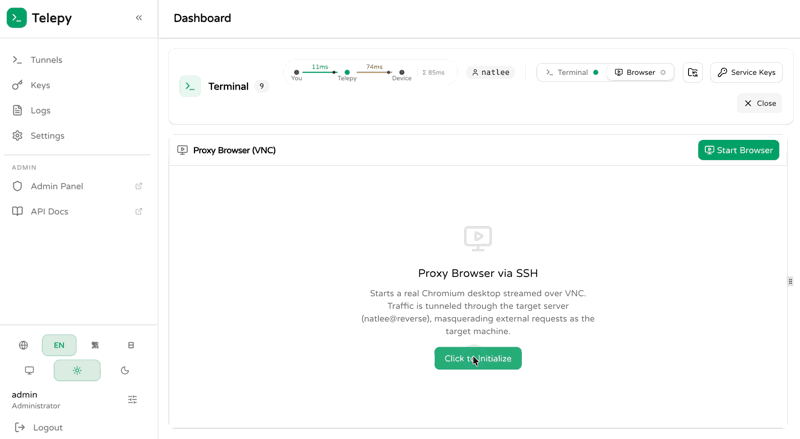

# Telepy

**English** | [繁體中文](./README.zh-TW.md) | [日本語](./README.ja.md)

A self-hosted web platform for managing **reverse SSH tunnels**. Register a device once, then reach it from anywhere: monitor tunnel health on a live dashboard, open a terminal in your browser, manage files over SFTP, share access with teammates, and even browse the web *through* the remote device.

## Features

- **Tunnel dashboard** — live online/offline status and per-hop latency (you → Telepy → device), in list or card view.
- **Guided tunnel creation** — a five-step wizard issues keys and generates ready-to-run connection scripts: plain SSH, AutoSSH, systemd service, PowerShell, Docker Run, and Docker Compose, plus a single-use `curl` URL for fetching the script on the target machine.
- **Web terminal** — multi-tab xterm.js terminal over WebSocket, with per-user sessions and live latency readout.
- **File manager** — SFTP-based file browser alongside the terminal for uploading and downloading files on the device.
- **Remote proxy browser** — launch a real Chromium desktop (KasmVNC) whose traffic is tunneled through the target device, so external requests appear to come from that machine.
- **Sharing & permissions** — share tunnels with other users under hierarchical VIEW / EDIT / ADMIN permissions.
- **Keys & logs** — manage authorized keys and inspect SSH server logs from the UI.
- **Authentication** — Google OAuth2 or username/password, JWT-backed API. The first user to log in becomes the superuser.
- **Internationalization & theming** — English, 繁體中文, and 日本語; light and dark themes.

## Usage

### Create a tunnel

Go to **Tunnels → Create Tunnel**, paste the device's SSH public key, and follow the wizard. Run the generated script on the device and the tunnel comes online.



### Web terminal

Click **Terminal** on any online tunnel to get a shell on the device, straight from the browser.



### Remote proxy browser

Click **Browser** on an online tunnel to start a Chromium session that browses the web through the device (SSH SOCKS proxy + KasmVNC streaming).



## How it works

The device keeps a reverse SSH connection (`ssh -NR <port>:localhost:22 telepy@server`) to Telepy's SSH container, which assigns each tunnel a dedicated port. The web terminal, file manager, and proxy browser all reach the device through that port — no inbound firewall rules or public IP needed on the device side.

Telepy runs as six containers orchestrated by Docker Compose:

| Service        | Role                                                        |
| -------------- | ----------------------------------------------------------- |
| `traefik`      | Reverse proxy; routes `/api/*` & `/ws/*` to the backend, everything else to the frontend |
| `frontend`     | Next.js web UI                                              |
| `backend`      | Django + DRF + Channels (REST API & WebSocket terminal)     |
| `redis`        | Cache and channel layer                                     |
| `ssh`          | OpenSSH server that terminates the reverse tunnels          |
| `kasm-browser` | KasmVNC + Chromium for remote browser sessions              |

## Quick start

Requires Docker with the Compose plugin.

1. Create your environment file and adjust as needed:

   ```bash
   cp .env.example .env
   ```

2. Generate the SSH server keys:

   ```bash
   ./telepy.sh keygen
   ```

3. Build and start the stack:

   ```bash
   docker compose up -d --build
   ```

4. Open `http://localhost:<WEB_SERVER_PORT>/login` (default: `http://localhost:8787/login`) and sign in.

> [!NOTE]
> The **first user** created becomes the superuser — whether via Google login or `./telepy.sh create-superuser` (check `dev-scripts/dev-create-superuser.sh` to change the default username/password before running it).

### Connect a device

1. **Tunnels → Create Tunnel**, paste the device's SSH public key, and complete the wizard (add at least one OS username that exists on the device).
2. Append the shown service key to `~/.ssh/authorized_keys` on the device.
3. Run the generated connection script on the device (SSH for quick tests, AutoSSH/systemd/Docker for something persistent). Scripts can be retrieved any time from the tunnel's **Scripts** action.
4. When the tunnel shows **Online**, the terminal, file manager, and remote browser are ready to use.

## Configuration

Environment variables in `.env`:

| Variable                  | Default     | Description                                  |
| ------------------------- | ----------- | -------------------------------------------- |
| `PROJECT_NAME`            | `main`      | Suffix for container names                   |
| `DEBUG`                   | `false`     | Django debug mode                            |
| `WEB_SERVER_PORT`         | `8787`      | Port Traefik exposes the web UI on           |
| `REVERSE_SERVER_SSH_PORT` | `24242`     | Port devices connect their reverse SSH to    |
| `SOCIAL_GOOGLE_CLIENT_ID` | —           | Google OAuth client ID                       |
| `SERVER_DOMAIN`           | `localhost` | Public hostname of your Telepy server        |
| `INTERNAL_API_TOKEN`      | —           | Secret for internal service-to-service calls |

## CLI helper

`./telepy.sh` wraps the day-to-day maintenance scripts:

```
Usage: ./telepy.sh sub-command [args]
Sub-commands:
  keygen: Generate SSH keys for Telepy service.
  create-superuser: Create an admin account for Telepy management.
  shell: Create a shell to run arbitrary command.
  ipython: Create a shell to run ipython.
  supervisorctl: Attach to supervisor control shell.
  ssh-shell: Similar to 'shell', but for ssh container.
  migration: Run migration process.
  backend-debug: Recreate and attach to backend container.
  collect-static: Collect static files to increase rendering speed.
  django-startapp: Create a new Django app.
```

## API documentation

Log in first, then visit:

- Swagger UI — `http://localhost:<WEB_SERVER_PORT>/api/__hidden_swagger`
- ReDoc — `http://localhost:<WEB_SERVER_PORT>/api/__hidden_redoc`
- Django admin — `http://localhost:<WEB_SERVER_PORT>/api/__hidden_admin/`

## Further reading

- [Remote browser architecture](./docs/remote-browser.md)
- [Latency measurement deep dive](./docs/latency-deep-dive.md)
- [Articles](./docs/articles/)

## Contributors

<!-- ALL-CONTRIBUTORS-LIST:START - Do not remove or modify this section -->
<!-- prettier-ignore-start -->
<!-- markdownlint-disable -->
<table>
  <tbody>
    <tr>
      <td align="center"><a href="https://github.com/NatLee"><br /><sub><b>Nat Lee</b></sub></a></td>
      <td align="center"><a href="https://github.com/h-alice"><br /><sub><b>H. Alice</b></sub></a></td>
      <td align="center"><a href="https://github.com/boris-lok"><br /><sub><b>Boris Lok</b></sub></a></td>
    </tr>
  </tbody>
</table>

<!-- markdownlint-restore -->
<!-- prettier-ignore-end -->

<!-- ALL-CONTRIBUTORS-LIST:END -->

## License

[MIT](./LICENSE)
